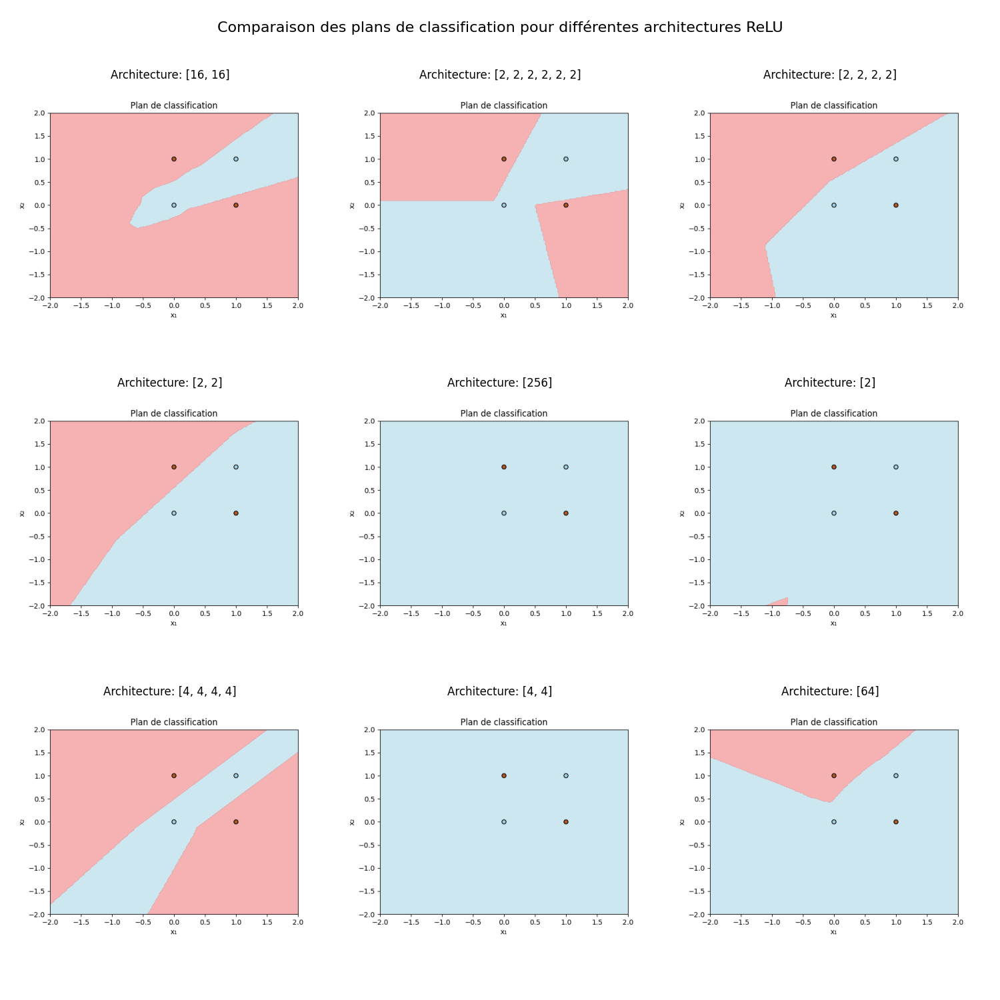
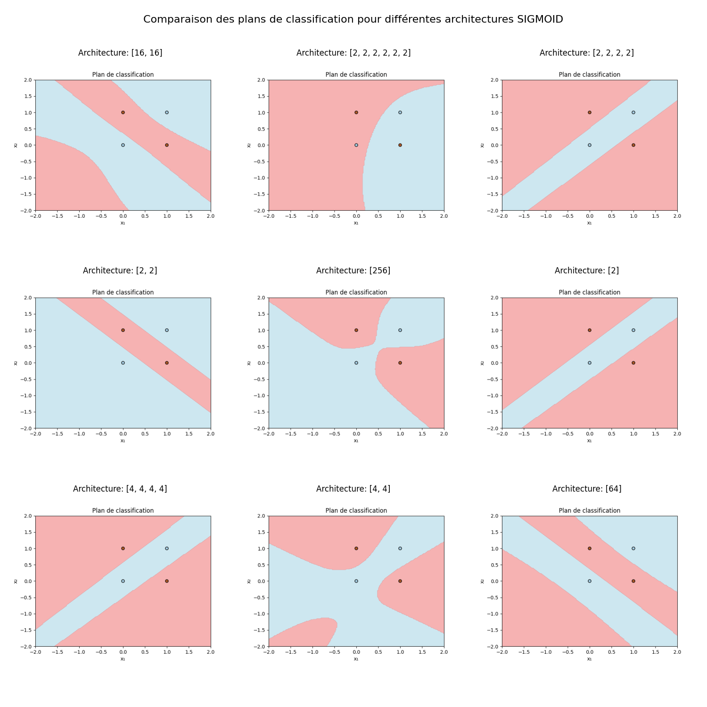
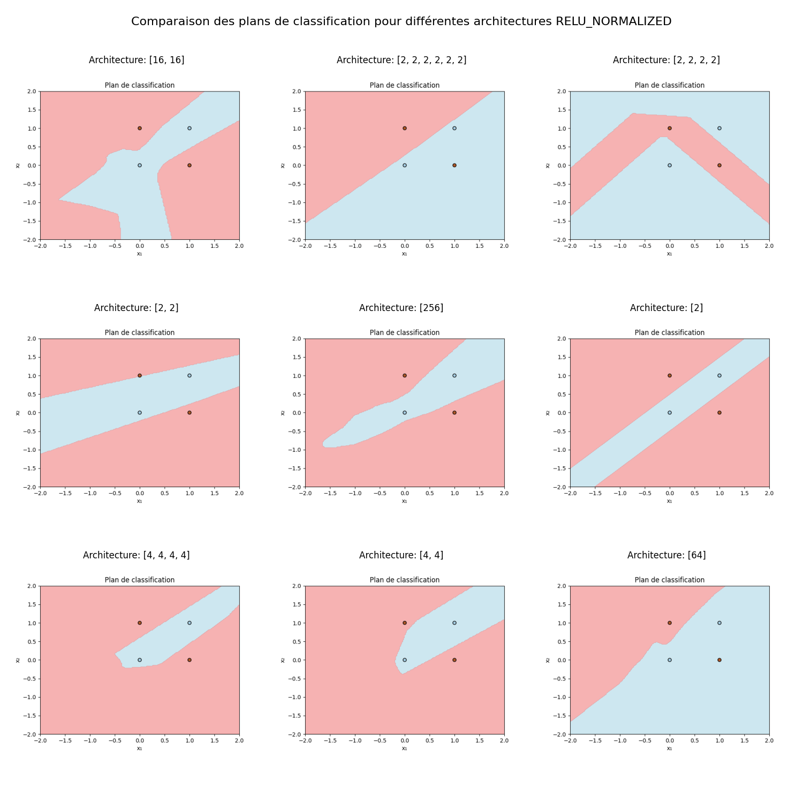

# Implémentation de la Rétropropagation dans un MLP

## Description

Ce projet implémente un réseau de type MLP. Il est conçu pour résoudre un problème de classification binaire, non linéaire, simples (fonction XOR).

## Structure du Projet

- `main.py`: Point d'entrée du programme.
- `network.py`: Classe du réseau de neurones.
- `layers.py`: Classe pour les couches du réseau.
- `activations.py`: Fonctions d'activation et leurs dérivées.
- `data.py`: Chargement des données.
- `config.py`: Configuration et hyperparamètres.
- `README.md`: Instructions et informations sur le projet.
- `requirements.txt`: Dépendances requises.
- `combine.py`: Combinaison des résultats des différentes configurations.
- `models/`: Dossier pour les résultats des différentes configurations.

## Prérequis

- Python 3.12
- Numpy

## Installation

1. Télécharger les fichiers.
2. Installer les dépendances avec la commande :

```bash
pip install -r requirements.txt
```

## Configuration

- `config.py` : Configuration et hyperparamètres.

## Exécution

- Exécuter avec autant de configurations que voulu le programme avec la commande :
```bash
python main.py
```
- Combinez les résultats des différentes configurations avec la commande :
```bash
python combine.py
```

## Résultats

- Plusieurs configurations ont été testées :
    - Résultats enregistrés dans le dossier `models`
    - Les dossiers sont nommés selon la configuration: `<fonction d'activation>_hl=<liste des nombres de neurones par couche cachée>` et contiennent les fichiers `classification_plane.png` et `loss.png`
    - Une combinaison des résultats des différentes configurations est présente dans le dossier `models/combined` et est nommée `combined_<fonction d'activation>_classifications.png`.
    - Fonctions d'activation testées : sigmoid, relu et relu_normalized
    - Taux d'apprentissage : dépend de la configuration.

- Initialisation des poids :
    - Initialisation Xavier pour sigmoid : permet de maintenir la variance du signal à travers les couches
    - Initialisation He pour relu et relu_normalized : prend en compte le fait que ReLU met à zéro environ la moitié de ses entrées, nécessitant une variance plus élevée dans l'initialisation des poids

- Relu :
    - Le taux d'apprentissage est très dur à régler pour la fonction relu. La dérivée de ReLU étant égale à 1 pour toutes les valeurs positives, les gradients peuvent devenir très grands et causer des problèmes d'instabilités à cause d'une explosion du gradient. On peut réduire le taux d'apprentissage, mais la loss diminue très lentement au bout d'un certain temps. Une méthode de descente de gradient adaptative pourrait être plus efficace. L'option choisie ici est de normaliser le gradient.



- Sigmoid :
    - Les résultats sont biens meilleurs avec la fonction sigmoid qu'avec relu, mais on voit qu'avec la configuration [2, 2, 2, 2, 2, 2] On converge vers un minimum local de la loss qui vaut environ 0.25 et ce peut importe le taux d'apprentissage. C'est un problème de vanishing gradient dont la fonction sigmoid est sensible lorsque le nombre de couches cachées augmente.



- Relu_normalized :
    - La normalisation du gradient permet de résoudre le problème de l'explosion du gradient pour la fonction relu et permet de faire des résultats similaires à la fonction sigmoid avec un taux d'apprentissage moins difficile à régler.


